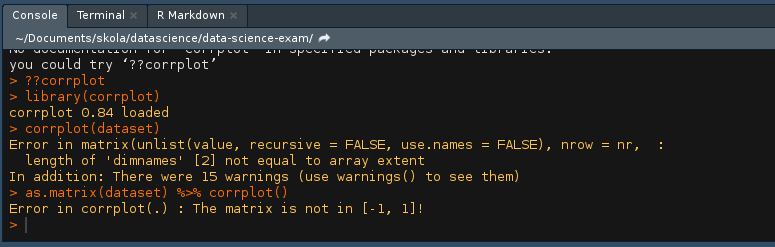

# Installationsguide av verktyg med anknytning till INS300

## Installation av R

####Följ installationsguiden som blir presenterat vid start av filen.  
Windows: https://cran.r-project.org/bin/windows/base/R-3.5.1-win.exe  
Mac: https://cran.r-project.org/bin/macosx/R-3.5.1.pkg  
Linux:
```
Öppna konsollen (CMD / ledetekst)
Skriv in: 
sudo apt-get install r-base r-base-dev
```

### Installation av R studio

Windows: https://download1.rstudio.org/RStudio-1.1.463.exe  
Mac: https://download1.rstudio.org/RStudio-1.1.463.dmg  
Linux: 
```
Skriv in detta i konsollen (CMD / ledetekst)
sudo apt-get install gdebi-core
wget https://download1.rstudio.org/rstudio-0.99.896-amd64.deb
sudo gdebi -n rstudio-0.99.896-amd64.deb
rm rstudio-0.99.896-amd64.deb
```

### Packages som blir brukt

Öppna R-studio  
Segmentet längst ned ska öppna en console
  
I denna kan du skriva in detta för att installer dem packages som behövs för att ta bruk av den koden som blivit använt.  
```
install.packages("ggplot2"")
install.packages("magrittr")
install.packages("zipcode")
install.packages("lubridate")
install.packages("dplyr")
install.packages("leaflet")
install.packages("leaflet.extras")
install.packages("htmlwidgets")

```

## Installation av Python
