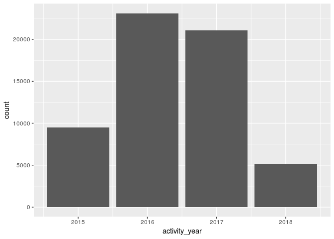
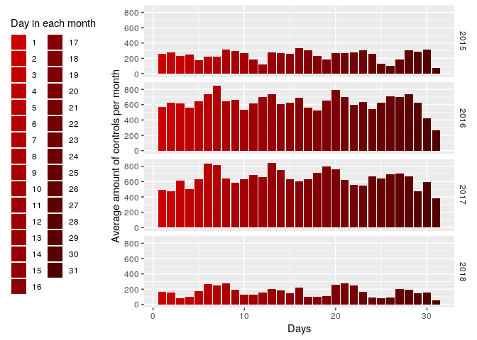

Eksamensoppgave INS300 Data Science – Høsten 2018
================

Oppgave 1: Importering av data (5%)
-----------------------------------

Denne oppgaven innebærer å analysere og arbeide med et datasett.

Vi har valgt at bruke filen «restaurant-and-market-health- inspections.csv» som følger med eksamensoppgaven

#### Including the dataset

``` r
  dataset <- read.csv("csv/restaurant-and-market-health-inspections.csv")
```

#### Including libraries

``` r
library(ggplot2) # usage: plotting tool
library(magrittr) # usage: pipeline
library(zipcode) # usage: cleaning zipcodes
data(zipcode) # usage: dataset for matching zipcodes
library(lubridate) # usage: gives better date functions
require(dplyr) # usage: data manipulation
library(leaflet) # usage: creates a map with nodes
```

#### Data preperation

``` r
# cleaning zipcodes
dataset$facility_zip <- clean.zipcodes(dataset$facility_zip)
# format the date from POSIX to more usable date format
dataset$activity_date <- dataset$activity_date %>% as.Date()
# uses lubridate to create new date columns
dataset$activity_year <- dataset$activity_date %>% year()
dataset$activity_month <- dataset$activity_date %>% month()
dataset$activity_day <- dataset$activity_date %>% day()

# getting longitude and latitude
dataset$lng <- zipcode$longitude[match(dataset$facility_zip, zipcode$zip)]
dataset$lat <- zipcode$latitude[match(dataset$facility_zip, zipcode$zip)]

# Average per year
dataset %>% 
  group_by(activity_year) %>% 
  summarize(average=mean(score)) %>% 
  as.data.frame()
```

    ##   activity_year  average
    ## 1          2015 92.89265
    ## 2          2016 93.29184
    ## 3          2017 93.39523
    ## 4          2018 93.78681

``` r
# amount inspections done each year # exchange fill #
ggplot(dataset, aes(activity_year)) + 
  geom_bar(fill = c("green", "red", "blue", "orange"))
```



``` r
# inspections on specific days, each year
ggplot(dataset, aes(activity_day)) + 
  geom_bar() + 
  facet_grid(activity_year ~ .)
```



Oppgave 2: Dataforståelse (10%)
-------------------------------

**1) Hva slags datasett er dette? Forklar hva slags objekter det er snakk om, og hva slags attributter (egenskaper) de har, samt eventuelle relasjoner.**

**2) Hva slags datatyper fins i datasettet? Gi konkrete eksempler og begrunn svaret ditt.**

Oppgave 3: Nytteverdi (15%)
---------------------------

**1) Hva kan du bruke datasettet til? Vis 3 forskjellige anvendelser, eller eksempler på verdi du kan få ut av datasettet.**

**2) Er datasettet klart til å analyseres som det er, eller må noe bearbeides før bruk? Begrunn svaret ditt.**

Oppgave 4: Analyse og modellering (40%)
---------------------------------------

**1) Hvilke metoder vil du bruke for å analysere dataene, gitt minst en av anvendelsene du har nevnt over? Her bør du tenke over ting som modeller (f.eks. innen maskinlæring), statistiske metoder, visualiseringer og tilsvarende. Begrunn metodene du har valgt.**

**2) Gjennomfør analysene som nevnt over.**

Oppgave 5: Resultat og evaluering (30%)
---------------------------------------

**1) Hva fikk du ut av dataene? Her skal du vise konkrete tall, figurer, visualiseringer og liknende.**

**2) Gjennomfør en kritisk refleksjon over resultatet og innsikten du har kommet frem til. Gjør bruk av pensumlitteraturen og andre relevante kilder for å begrunne din argumentasjon.**
